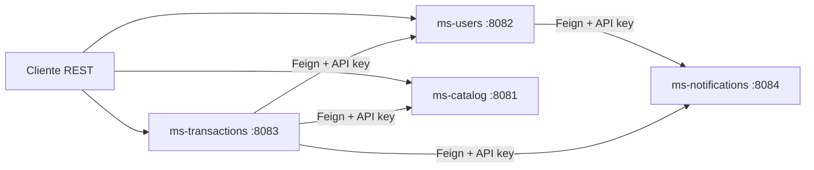

# Blockbuster Microservices

Monorepo de una plataforma de arriendo de peliculas inspirada en Blockbuster, implementada con arquitectura de microservicios sobre Spring Boot. El proyecto separa identidad, catalogo, transacciones y notificaciones en servicios independientes, cada uno con su propia persistencia y contratos HTTP internos claramente definidos.

## Caso de negocio

El sistema modela una operacion de arriendo de peliculas donde:

- los usuarios deben registrarse e iniciar sesion
- el catalogo debe mantener categorias, peliculas, disponibilidad y stock
- los arriendos deben validar usuario, descontar inventario y registrar el movimiento
- las notificaciones deben dejar trazabilidad de eventos relevantes del flujo

El caso de uso principal no ocurre en un solo modulo. Ocurre por colaboracion entre varios microservicios coordinados por contratos REST.

## Objetivo tecnico del proyecto

El repositorio demuestra:

- separacion de responsabilidades por dominio
- seguridad externa con JWT
- seguridad interna con API key compartida
- persistencia relacional y documental segun necesidad del servicio
- integracion entre microservicios con OpenFeign
- versionado de esquema con Flyway en los servicios relacionales
- validacion y manejo uniforme de errores en API REST

## Arquitectura general



## Microservicios

| Servicio | Puerto | Persistencia | Responsabilidad principal | Seguridad externa | Seguridad interna |
| --- | --- | --- | --- | --- | --- |
| `ms-users` | `8082` | PostgreSQL | usuarios, roles, registro, login y JWT | JWT | API key |
| `ms-catalog` | `8081` | PostgreSQL | categorias, peliculas, disponibilidad y stock | JWT | API key |
| `ms-transactions` | `8083` | PostgreSQL | arriendos, devoluciones e integracion de negocio | JWT | API key |
| `ms-notifications` | `8084` | MongoDB | registro y simulacion de notificaciones | no expone flujo de cliente final | API key |

## Flujo principal del sistema

### Registro

1. El cliente envia `POST /api/v1/auth/register` a `ms-users`.
2. `ms-users` valida unicidad de `username` y `email`.
3. La password se cifra con BCrypt.
4. El usuario se persiste en PostgreSQL.
5. `ms-users` envia una notificacion de bienvenida a `ms-notifications`.

### Login

1. El cliente envia `POST /api/v1/auth/login` a `ms-users`.
2. Spring Security autentica credenciales.
3. `ms-users` genera un JWT con identidad y rol.
4. El cliente reutiliza ese token sobre `catalog` y `transactions`.

### Arriendo

1. El cliente autenticado envia `POST /api/v1/rentals` a `ms-transactions`.
2. `ms-transactions` valida al usuario con `ms-users`.
3. `ms-transactions` solicita descuento de stock a `ms-catalog`.
4. `ms-transactions` persiste el arriendo y sus detalles.
5. `ms-transactions` registra la confirmacion en `ms-notifications`.

### Devolucion

1. El cliente autorizado envia `PATCH /api/v1/rentals/{id}/return`.
2. `ms-transactions` valida el estado del arriendo.
3. `ms-transactions` solicita reintegro de stock a `ms-catalog`.
4. `ms-transactions` actualiza el estado a `RETURNED`.
5. `ms-transactions` registra la confirmacion de devolucion en `ms-notifications`.

## Seguridad

### JWT para consumo externo

Se usa JWT Bearer en:

- `ms-users`
- `ms-catalog`
- `ms-transactions`

Estos servicios deben compartir:

- `JWT_SECRET`
- `JWT_EXPIRATION`

### API key para integracion interna

Los endpoints internos se protegen con:

```text
X-Internal-Api-Key: <shared-key>
```

La misma `INTERNAL_API_KEY` debe existir en los cuatro microservicios.

### Idea clave

JWT representa al usuario final. La API key representa confianza entre servicios. No resuelven el mismo problema.

## Persistencia

### PostgreSQL

Se usa en:

- `users`
- `catalog`
- `transactions`

Porque estos dominios requieren:

- relaciones claras
- integridad estructural
- restricciones de unicidad
- transacciones relacionales

### MongoDB

Se usa en:

- `notifications`

Porque el servicio persiste eventos autocontenidos de notificacion sin necesidad de joins o relaciones complejas.

## Estructura del repositorio

```text
blockbuster-microservices/
|- catalog/
|  \- catalog/
|- users/
|  \- users/
|- transactions/
|  \- transactions/
|- notifications/
|  \- notifications/
\- docs/
   \- postman/
```

## Documentacion del proyecto

### Documentacion por servicio

- [ms-users](./users/users/README.md)
- [ms-catalog](./catalog/catalog/README.md)
- [ms-transactions](./transactions/transactions/README.md)
- [ms-notifications](./notifications/notifications/README.md)

### Coleccion Postman

- [Guia de Postman](./docs/postman/README.md)
- [Collection](./docs/postman/Blockbuster-system-integration.postman_collection.json)
- [Environment local](./docs/postman/Blockbuster-local.postman_environment.json)

## Configuracion local

Cada microservicio incluye un archivo `.env.example` con las variables necesarias para levantar el servicio localmente. Antes de ejecutar, debe existir un archivo `.env` por modulo con los valores reales del entorno.

Variables compartidas de integracion:

- `JWT_SECRET`
- `JWT_EXPIRATION`
- `INTERNAL_API_KEY`
- `USERS_SERVICE_URL=http://localhost:8082`
- `CATALOG_SERVICE_URL=http://localhost:8081`
- `NOTIFICATIONS_SERVICE_URL=http://localhost:8084`

## Orden de arranque recomendado

1. `notifications/notifications`
2. `users/users`
3. `catalog/catalog`
4. `transactions/transactions`

Desde cada modulo:

```powershell
mvn spring-boot:run
```

## Accesos y pruebas basicas

### Credencial administradora semilla

- `username`: `admin`
- `password`: `Admin123!`

### Verificaciones minimas sugeridas

- `POST /api/v1/auth/login`
- `GET /api/v1/movies/available`
- `POST /api/v1/rentals`
- `PATCH /api/v1/rentals/{id}/return`
- `POST /api/v1/notifications` con API key valida

## Estado funcional relevante

El proyecto incluye:

- documentacion OpenAPI por microservicio
- flujo de arriendo con descuento real de stock
- flujo de devolucion con reintegro real de stock
- integracion interna protegida por API key
- respuesta uniforme de errores con `timestamp`, `status`, `message` y `path`

## Ejecutar pruebas

Desde el modulo correspondiente:

```powershell
mvn test
```

Las suites cubren, segun el servicio:

- validaciones DTO
- mappers
- servicios
- seguridad JWT
- seguridad interna por API key
- controladores con MockMvc
- repositorios con soporte de migraciones en pruebas

## Tecnologias principales

- Java 21
- Spring Boot 4.0.6
- Spring Security
- JJWT
- Spring Data JPA
- Spring Data MongoDB
- PostgreSQL
- MongoDB
- Flyway
- OpenFeign
- Apache HttpClient 5
- Spring Validation
- Springdoc OpenAPI
- JUnit 5
- Mockito
- MockMvc
