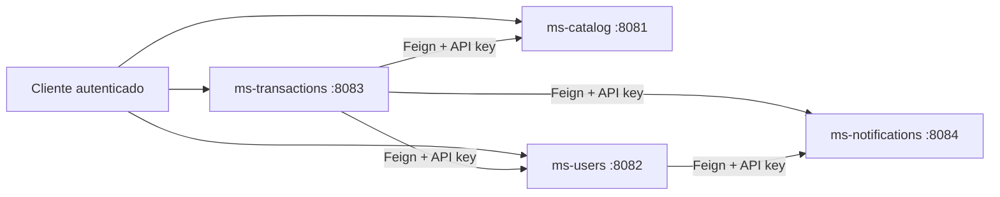

# Blockbuster Microservices

Monorepo academico para la simulacion de una plataforma Blockbuster basada en microservicios con Spring Boot, PostgreSQL, MongoDB, JWT, OpenFeign y Flyway.

## Microservicios

| Servicio | Puerto | Responsabilidad | Seguridad externa | Seguridad interna |
| --- | --- | --- | --- | --- |
| `ms-catalog` | `8081` | categorias, peliculas y stock | JWT | API key |
| `ms-users` | `8082` | registro, login, roles y usuarios | JWT | API key |
| `ms-transactions` | `8083` | arriendos y devoluciones | JWT | API key |
| `ms-notifications` | `8084` | envio y registro de notificaciones | no expone consumo publico | API key |

## Mapa del sistema



## Flujo principal validado

1. Un usuario se registra en `ms-users`.
2. `ms-users` envia una bienvenida a `ms-notifications`.
3. El usuario inicia sesion y recibe un JWT.
4. `ms-transactions` recibe una solicitud de arriendo autenticada.
5. `ms-transactions` valida al usuario en `ms-users`.
6. `ms-transactions` descuenta stock en `ms-catalog`.
7. `ms-transactions` guarda el arriendo.
8. `ms-transactions` envia la confirmacion a `ms-notifications`.

## Seguridad

### JWT para clientes

Se usa JWT Bearer en:

- `ms-users`
- `ms-catalog`
- `ms-transactions`

El mismo `JWT_SECRET` y `JWT_EXPIRATION` deben estar alineados entre esos tres servicios.

### API key para llamadas internas

Se usa la cabecera:

```text
X-Internal-Api-Key: <shared-key>
```

El mismo `INTERNAL_API_KEY` debe existir en los cuatro microservicios.

## Variables compartidas

Valores que deben coincidir para que la interoperabilidad funcione:

- `JWT_SECRET`
- `JWT_EXPIRATION`
- `INTERNAL_API_KEY`
- `USERS_SERVICE_URL=http://localhost:8082`
- `CATALOG_SERVICE_URL=http://localhost:8081`
- `NOTIFICATIONS_SERVICE_URL=http://localhost:8084`

## Orden de arranque local

1. `notifications/notifications`
2. `users/users`
3. `catalog/catalog`
4. `transactions/transactions`

En cada modulo:

```powershell
mvn spring-boot:run
```

## Datos de demo

### Credencial administradora semilla

- `username`: `admin`
- `password`: `Admin123!`

### Coleccion Postman

La validacion manual del sistema completo esta en:

- [docs/postman/Blockbuster-system-integration.postman_collection.json](</C:/Users/marti/OneDrive/Desktop/BlockBuster Microservices/blockbuster-microservices/docs/postman/Blockbuster-system-integration.postman_collection.json>)
- [docs/postman/Blockbuster-local.postman_environment.json](</C:/Users/marti/OneDrive/Desktop/BlockBuster Microservices/blockbuster-microservices/docs/postman/Blockbuster-local.postman_environment.json>)
- [docs/postman/README.md](</C:/Users/marti/OneDrive/Desktop/BlockBuster Microservices/blockbuster-microservices/docs/postman/README.md>)

## Documentacion por servicio

- [catalog/catalog/README.md](</C:/Users/marti/OneDrive/Desktop/BlockBuster Microservices/blockbuster-microservices/catalog/catalog/README.md>)
- [users/users/README.md](</C:/Users/marti/OneDrive/Desktop/BlockBuster Microservices/blockbuster-microservices/users/users/README.md>)

## Estado tecnico

- `catalog` y `users` usan Flyway con versionado de esquema y datos semilla.
- `transactions` mantiene Flyway productivo y usa migraciones H2 de test para no perder versionado en pruebas.
- `notifications` usa MongoDB y valida acceso interno por API key.
- el formato de error fue unificado en los servicios integrados con la estructura `timestamp`, `status`, `message`, `path`.
