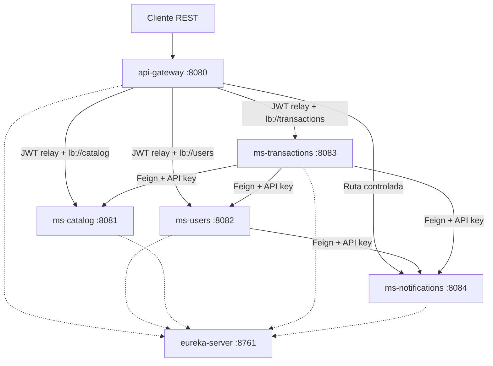

# Blockbuster Microservices

Monorepo de una plataforma de arriendo de peliculas inspirada en Blockbuster, implementada con arquitectura de microservicios sobre Spring Boot. El sistema separa identidad, catalogo, transacciones, notificaciones e infraestructura en componentes independientes, con persistencia desacoplada y comunicacion REST controlada.

## Caso de negocio

La plataforma modela un flujo de arriendo donde:

- un usuario debe registrarse e iniciar sesion
- el catalogo debe administrar peliculas, categorias, disponibilidad y stock
- los arriendos deben validar al usuario, descontar inventario y registrar el movimiento
- las devoluciones deben reintegrar stock y actualizar el estado del arriendo
- las notificaciones deben dejar trazabilidad de eventos relevantes del flujo

El caso de uso principal no ocurre en un solo modulo. Se resuelve por colaboracion entre varios microservicios, con responsabilidades bien separadas.

## Objetivo tecnico

El repositorio demuestra:

- separacion de responsabilidades por dominio
- patron CSR con capas `controller`, `service`, `repository` y `model`
- seguridad externa con JWT Bearer
- seguridad interna con API key compartida
- integracion REST entre microservicios con OpenFeign
- versionado de esquema con Flyway en los servicios relacionales
- documentacion OpenAPI por microservicio
- pruebas unitarias y de capa web sobre flujos criticos
- despliegue local y por contenedores con Docker Compose
- descubrimiento de servicios con Eureka y enrutamiento centralizado con API Gateway

## Arquitectura general


```mermaid
flowchart TD
    Client["Cliente REST"] --> Gateway["api-gateway :8080"]

    Gateway -->|JWT relay + lb://users| Users["ms-users :8082"]
    Gateway -->|JWT relay + lb://catalog| Catalog["ms-catalog :8081"]
    Gateway -->|JWT relay + lb://transactions| Transactions["ms-transactions :8083"]
    Gateway -->|Ruta controlada| Notifications["ms-notifications :8084"]

    Gateway -.-> Eureka["eureka-server :8761"]
    Users -.-> Eureka
    Catalog -.-> Eureka
    Transactions -.-> Eureka
    Notifications -.-> Eureka

    Users -->|Feign + API key| Notifications
    Transactions -->|Feign + API key| Users
    Transactions -->|Feign + API key| Catalog
    Transactions -->|Feign + API key| Notifications
```

## Servicios del ecosistema

| Servicio | Puerto | Persistencia | Rol principal | Seguridad externa | Seguridad interna |
| --- | --- | --- | --- | --- | --- |
| `eureka-server` | `8761` | - | registro y descubrimiento de servicios | - | - |
| `api-gateway` | `8080` | - | entrada unica, enrutamiento y relay de JWT | relay de JWT | - |
| `ms-users` | `8082` | PostgreSQL | usuarios, roles, registro, login y JWT | JWT | API key |
| `ms-catalog` | `8081` | PostgreSQL | categorias, peliculas, disponibilidad y stock | JWT | API key |
| `ms-transactions` | `8083` | PostgreSQL | arriendos, devoluciones e integracion de negocio | JWT | API key |
| `ms-notifications` | `8084` | MongoDB | registro de eventos y notificaciones | no es flujo principal de cliente | API key |

## Flujo funcional principal

### Registro

1. El cliente envia `POST /api/v1/auth/register` al `api-gateway`.
2. El gateway enruta la solicitud a `ms-users`.
3. `ms-users` valida unicidad de `username` y `email`, cifra la password y persiste al usuario.
4. `ms-users` registra una notificacion de bienvenida en `ms-notifications`.

### Login

1. El cliente envia `POST /api/v1/auth/login` al `api-gateway`.
2. `ms-users` autentica las credenciales y genera el JWT.
3. El token se reutiliza desde el cliente para consumir `catalog` y `transactions` por medio del gateway.

### Arriendo

1. El cliente autenticado envia `POST /api/v1/rentals` al `api-gateway`.
2. `ms-transactions` valida al usuario con `ms-users`.
3. `ms-transactions` solicita descuento de stock a `ms-catalog`.
4. El arriendo se persiste en PostgreSQL.
5. Se registra una confirmacion en `ms-notifications`.

### Devolucion

1. El cliente autorizado envia `PATCH /api/v1/rentals/{id}/return` al `api-gateway`.
2. `ms-transactions` valida el estado del arriendo.
3. `ms-transactions` solicita reintegro de stock a `ms-catalog`.
4. El arriendo cambia a estado `RETURNED`.
5. Se registra la devolucion en `ms-notifications`.

## Seguridad

### JWT para consumo externo

Se usa JWT Bearer en:

- `ms-users`
- `ms-catalog`
- `ms-transactions`

Todos esos servicios deben compartir:

- `JWT_SECRET`
- `JWT_EXPIRATION`

### API key para integracion interna

Los endpoints internos se protegen con:

```text
X-Internal-Api-Key: <shared-key>
```

La misma `INTERNAL_API_KEY` debe existir en:

- `ms-users`
- `ms-catalog`
- `ms-transactions`
- `ms-notifications`

JWT representa al usuario final. La API key representa confianza entre servicios. Son mecanismos complementarios, no intercambiables.

## Persistencia

### PostgreSQL

Se usa en:

- `users`
- `catalog`
- `transactions`

Porque esos dominios requieren:

- relaciones estructuradas
- integridad referencial
- restricciones de unicidad
- consistencia transaccional

### MongoDB

Se usa en:

- `notifications`

Porque el servicio registra eventos autocontenidos, sin joins ni relaciones complejas entre entidades.

## Infraestructura

### API Gateway

`api-gateway` centraliza las solicitudes externas en `http://localhost:8080` y enruta por nombre de servicio con `lb://`:

- `/api/v1/auth/**` y `/api/v1/users/**` -> `users`
- `/api/v1/movies/**`, `/api/v1/categories/**` y `/api/v1/catalog/**` -> `catalog`
- `/api/v1/rentals/**` -> `transactions`
- `/api/v1/notifications/**` -> `notifications`

Ademas aplica un filtro `TokenRelay` para propagar el header `Authorization` hacia los microservicios protegidos por JWT.

### Eureka Server

`eureka-server` expone el registro de servicios en `http://localhost:8761`. `api-gateway` y los microservicios de negocio se registran alli para permitir descubrimiento y enrutamiento dinamico sin URLs fijas entre servicios.

### Compatibilidad de versiones

La infraestructura (`api-gateway` y `eureka-server`) se mantiene sobre Spring Boot `3.3.4` y Spring Cloud `2023.0.3`, mientras que los microservicios de negocio usan Spring Boot `4.0.6` y Spring Cloud `2025.1.1`.

La interoperabilidad se mantiene porque:

- gateway y servicios de negocio se comunican por HTTP
- el registro de servicios se resuelve por protocolo Eureka
- no existe acoplamiento binario entre los modulos de infraestructura y los modulos de negocio

Las pruebas del repositorio validan que esta combinacion compila, arranca contexto y mantiene el contrato esperado.

## Documentacion por servicio

- [api-gateway](./api-gateway/README.md)
- [eureka-server](./eureka-server/README.md)
- [ms-users](./users/users/README.md)
- [ms-catalog](./catalog/catalog/README.md)
- [ms-transactions](./transactions/transactions/README.md)
- [ms-notifications](./notifications/notifications/README.md)

## Coleccion Postman

- [Guia de Postman](./docs/postman/README.md)
- [Collection](./docs/postman/Blockbuster-system-integration.postman_collection.json)
- [Environment local](./docs/postman/Blockbuster-local.postman_environment.json)

La coleccion usa dos criterios:

- las solicitudes de cliente final pasan por `api-gateway`
- las solicitudes internas protegidas por API key apuntan directo al microservicio responsable

## OpenAPI y Swagger

Los microservicios de negocio exponen documentacion interactiva:

- `http://localhost:8082/swagger-ui.html`
- `http://localhost:8081/swagger-ui.html`
- `http://localhost:8083/swagger-ui.html`
- `http://localhost:8084/swagger-ui.html`

Y sus documentos OpenAPI:

- `http://localhost:8082/v3/api-docs`
- `http://localhost:8081/v3/api-docs`
- `http://localhost:8083/v3/api-docs`
- `http://localhost:8084/v3/api-docs`

## Configuracion local

Cada microservicio de negocio incluye su propio `.env.example`. Antes de ejecutar localmente, debe existir un archivo `.env` por modulo con sus valores reales.

Variables compartidas mas relevantes:

- `JWT_SECRET`
- `JWT_EXPIRATION`
- `INTERNAL_API_KEY`
- `USERS_SERVICE_URL=http://localhost:8082`
- `CATALOG_SERVICE_URL=http://localhost:8081`
- `NOTIFICATIONS_SERVICE_URL=http://localhost:8084`

## Orden de arranque local recomendado

1. `eureka-server`
2. `api-gateway`
3. `notifications/notifications`
4. `users/users`
5. `catalog/catalog`
6. `transactions/transactions`

Desde cada modulo:

```powershell
mvn spring-boot:run
```

## Ejecucion con Docker Compose

El repositorio incluye:

- [docker-compose.yml](./docker-compose.yml)
- [plantilla de variables Docker](./.env.docker.example)

Pasos:

1. Crear un archivo `.env` en la raiz del repositorio usando `.env.docker.example` como base.
2. Completar credenciales reales.
3. Ejecutar:

```powershell
docker compose up --build
```

## Pruebas

Cada modulo principal puede validarse con:

```powershell
mvn test
```

Para generar el reporte local de cobertura por modulo:

```powershell
mvn jacoco:report
```

Durante esta integracion quedaron verificados:

- `users/users`
- `catalog/catalog`
- `transactions/transactions`
- `notifications/notifications`
- `api-gateway`
- `eureka-server`

### Cobertura JaCoCo validada

Snapshot de cobertura sobre los microservicios de negocio:

| Servicio | Instruction coverage | Branch coverage |
| --- | --- | --- |
| `ms-users` | `95.21%` | cobertura validada en suite local |
| `ms-catalog` | `96.03%` | `84.29%` |
| `ms-transactions` | `95.64%` | cobertura validada en suite local |
| `ms-notifications` | `96.36%` | cobertura validada en suite local |

Promedio agregado de los servicios de negocio:

- instruction coverage: `95.71%`
- branch coverage: `79.38%`
- line coverage: `96.03%`
- method coverage: `95.10%`

## Credenciales semilla relevantes

- `admin / Admin123!`
- `empleado.centro / Admin123!`
- `laura.cliente / Admin123!`

## Estructura del repositorio

```text
blockbuster-microservices/
|- api-gateway/
|- eureka-server/
|- catalog/
|  \- catalog/
|- users/
|  \- users/
|- transactions/
|  \- transactions/
|- notifications/
|  \- notifications/
|- docs/
|  \- postman/
|- docker-compose.yml
\- README.md
```

## Estado funcional cubierto

El proyecto cubre:

- autenticacion JWT
- catalogo con stock y disponibilidad
- arriendos con descuento de stock
- devoluciones con reintegro de stock
- notificaciones internas por API key
- documentacion OpenAPI
- descubrimiento de servicios con Eureka
- enrutamiento centralizado con API Gateway
- soporte de ejecucion local y por Docker Compose
