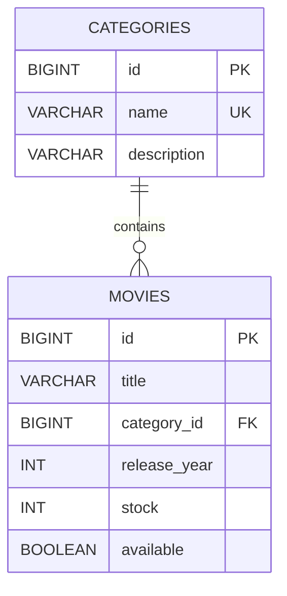
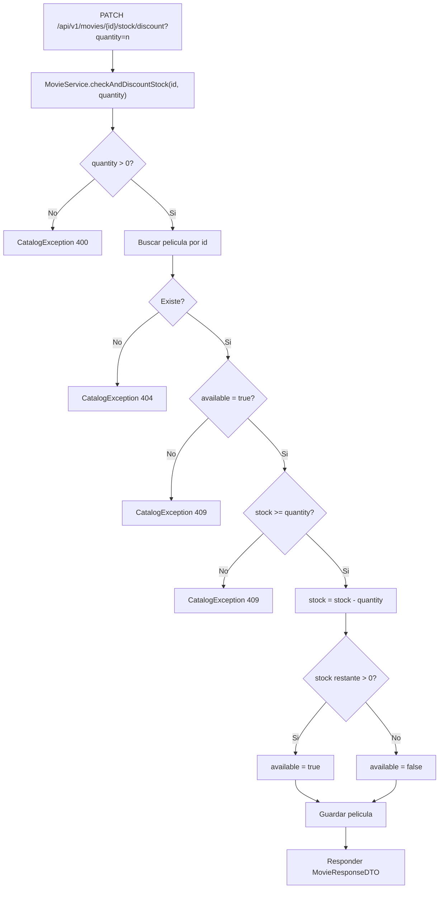

# ms-catalog

Microservicio de catalogo para el sistema Blockbuster.

Autor: Martin Caviedes

## Descripcion

`ms-catalog` administra las categorias y peliculas del sistema. Expone endpoints REST para crear, consultar, actualizar y eliminar registros del catalogo, y ademas contiene la regla de negocio para validar y descontar stock cuando una pelicula se arrienda.

## Stack tecnico

- Java 21
- Spring Boot 4.0.6
- Spring Data JPA
- PostgreSQL
- Flyway
- Spring Validation
- OpenFeign
- Springdoc OpenAPI
- JUnit 5
- Mockito
- MockMvc

## Estructura funcional

- `categories`: almacena categorias de peliculas.
- `movies`: almacena peliculas, su categoria, anio de estreno, stock y disponibilidad.
- `checkAndDiscountStock(...)`: valida existencia, disponibilidad y stock antes de descontar unidades.

## Modelo entidad-relacion



## Flujo de descuento de stock



## Variables locales

Crear un archivo `.env` en la raiz de este microservicio:

```properties
DB_USERNAME=neondb_owner
DB_PASSWORD=tu_password_real
```

Tambien existe el archivo [.env.example](</C:/Users/marti/OneDrive/Desktop/BlockBuster Microservices/blockbuster-microservices/catalog/catalog/.env.example>) como referencia.

## Configuracion principal

- Puerto: `8081`
- Base de datos: Neon PostgreSQL
- Flyway habilitado
- Swagger UI: `/swagger-ui.html`
- OpenAPI JSON: `/v3/api-docs`

## Como ejecutar el proyecto

Desde [catalog/catalog](</C:/Users/marti/OneDrive/Desktop/BlockBuster Microservices/blockbuster-microservices/catalog/catalog>):

```powershell
mvn test
mvn spring-boot:run
```

La API quedara disponible en:

- `http://localhost:8081/api/v1/categories`
- `http://localhost:8081/api/v1/movies`
- `http://localhost:8081/swagger-ui.html`

## Migraciones Flyway

Las migraciones estan en [src/main/resources/db/migration](</C:/Users/marti/OneDrive/Desktop/BlockBuster Microservices/blockbuster-microservices/catalog/catalog/src/main/resources/db/migration>):

- `V1__create_initial_tables.sql`
- `V2__insert_initial_data.sql`
- `V3__add_audit_or_constraints.sql`

## Endpoints principales

### Categorias

- `POST /api/v1/categories`
- `GET /api/v1/categories`
- `GET /api/v1/categories/{id}`
- `PUT /api/v1/categories/{id}`
- `DELETE /api/v1/categories/{id}`

### Peliculas

- `POST /api/v1/movies`
- `GET /api/v1/movies`
- `GET /api/v1/movies/{id}`
- `GET /api/v1/movies/category/{categoryId}`
- `GET /api/v1/movies/search?title=matrix`
- `GET /api/v1/movies/available`
- `PUT /api/v1/movies/{id}`
- `PATCH /api/v1/movies/{id}/stock/discount?quantity=1`
- `DELETE /api/v1/movies/{id}`

## Ejemplos de uso rapido

Crear categoria:

```bash
curl -X POST http://localhost:8081/api/v1/categories \
  -H "Content-Type: application/json" \
  -d "{\"name\":\"Drama\",\"description\":\"Peliculas dramaticas\"}"
```

Crear pelicula:

```bash
curl -X POST http://localhost:8081/api/v1/movies \
  -H "Content-Type: application/json" \
  -d "{\"title\":\"Inception\",\"categoryId\":3,\"releaseYear\":2010,\"stock\":6,\"available\":true}"
```

Descontar stock:

```bash
curl -X PATCH "http://localhost:8081/api/v1/movies/1/stock/discount?quantity=2"
```

## Respuesta de error estandar

El manejo global de errores responde con esta estructura:

```json
{
  "timestamp": "2026-05-16T22:00:00",
  "status": 409,
  "message": "Stock insuficiente para la pelicula con ID: 1",
  "path": "/api/v1/movies/1/stock/discount"
}
```

## Estado de pruebas

La suite actual valida:

- arranque del contexto
- migraciones Flyway
- mappers
- repositorios
- servicios
- controladores con MockMvc

Comando de verificacion:

```powershell
mvn test
```
