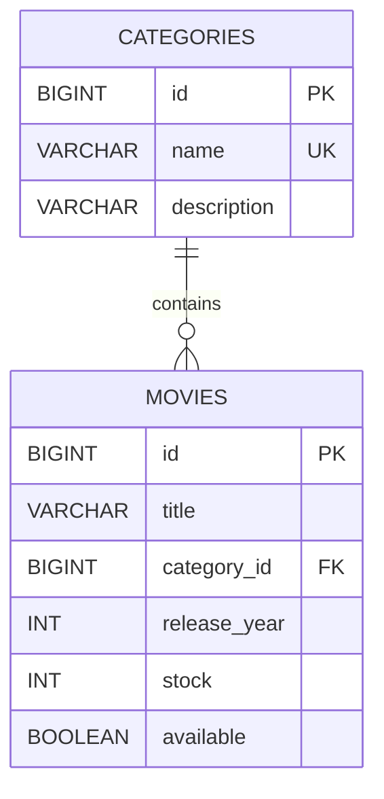
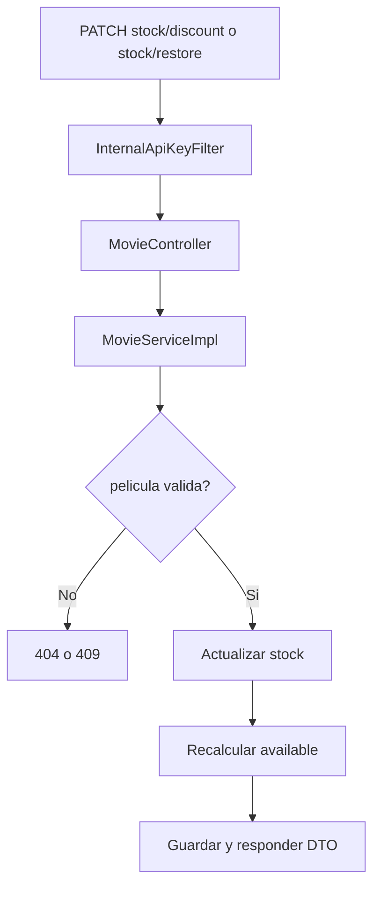

# ms-catalog

`ms-catalog` administra categorias, peliculas, disponibilidad y stock del sistema. Es el servicio duenio del inventario y expone tanto endpoints de consumo externo como operaciones internas para que `ms-transactions` pueda descontar y restaurar stock durante arriendos y devoluciones.

## Contexto dentro del sistema

Este microservicio responde por:

- estructura del catalogo
- clasificacion por categorias
- consulta de peliculas
- disponibilidad para arriendo
- mutaciones de stock bajo reglas controladas

No autentica usuarios ni crea arriendos. Su foco es inventario.

## Vista rapida

| Aspecto | Valor |
| --- | --- |
| Puerto | `8081` |
| Persistencia | PostgreSQL |
| Seguridad externa | JWT Bearer |
| Seguridad interna | API key compartida |
| Integracion entrante | `ms-transactions` |
| UI OpenAPI | `/swagger-ui.html` |

## Responsabilidades

- CRUD de categorias
- CRUD de peliculas
- consulta por categoria, titulo y disponibilidad
- validacion de stock
- descuento interno de stock
- reintegro interno de stock

## Endpoints principales

### Publicos

- `/swagger-ui.html`
- `/v3/api-docs`

### Protegidos por JWT

- `POST /api/v1/categories`
- `GET /api/v1/categories`
- `GET /api/v1/categories/{id}`
- `PUT /api/v1/categories/{id}`
- `DELETE /api/v1/categories/{id}`
- `POST /api/v1/movies`
- `GET /api/v1/movies`
- `GET /api/v1/movies/{id}`
- `GET /api/v1/movies/category/{categoryId}`
- `GET /api/v1/movies/search`
- `GET /api/v1/movies/available`
- `PUT /api/v1/movies/{id}`
- `DELETE /api/v1/movies/{id}`

### Internos protegidos por API key

- `PATCH /api/v1/movies/{id}/stock/discount?quantity=n`
- `PATCH /api/v1/movies/{id}/stock/restore?quantity=n`

Estos endpoints existen para integracion entre microservicios. No son endpoints de cliente final.

## Seguridad

Los endpoints internos estan expuestos en la cadena de seguridad solo para que `InternalApiKeyFilter` valide:

```text
X-Internal-Api-Key: <shared-key>
```

Sin esa cabecera valida, la operacion debe ser rechazada.

## Variables de entorno

Crear un archivo `.env` en este modulo usando como base [.env.example](./.env.example).

Variables esperadas:

```properties
DB_USERNAME=neondb_owner
DB_PASSWORD=replace_with_real_password
JWT_SECRET=replace_with_a_256_bit_secret
JWT_EXPIRATION=86400000
INTERNAL_API_KEY=replace_with_shared_internal_api_key
```

## Persistencia y migraciones

Flyway aplica:

- `V1__create_initial_tables.sql`
- `V2__insert_initial_data.sql`
- `V3__add_audit_or_constraints.sql`

### Modelo relacional



## Flujo interno de stock



## Ejemplos de uso

### Crear categoria

```bash
curl -X POST "http://localhost:8081/api/v1/categories" \
  -H "Authorization: Bearer TU_TOKEN" \
  -H "Content-Type: application/json" \
  -d '{"name":"Drama","description":"Peliculas dramaticas"}'
```

### Crear pelicula

```bash
curl -X POST "http://localhost:8081/api/v1/movies" \
  -H "Authorization: Bearer TU_TOKEN" \
  -H "Content-Type: application/json" \
  -d '{"title":"Inception","categoryId":3,"releaseYear":2010,"stock":6,"available":true}'
```

### Descuento interno de stock

```bash
curl -X PATCH "http://localhost:8081/api/v1/movies/1/stock/discount?quantity=2" \
  -H "X-Internal-Api-Key: SHARED_KEY"
```

### Reintegro interno de stock

```bash
curl -X PATCH "http://localhost:8081/api/v1/movies/1/stock/restore?quantity=2" \
  -H "X-Internal-Api-Key: SHARED_KEY"
```

## Ejecucion

Desde este modulo:

```powershell
mvn test
mvn spring-boot:run
```

## Cobertura funcional validada

- arranque del contexto
- migraciones Flyway en pruebas
- mappers
- repositorios
- servicios
- seguridad JWT
- seguridad interna por API key
- controladores con MockMvc

## Formato de error

```json
{
  "timestamp": "2026-05-17T22:00:00",
  "status": 409,
  "message": "Stock insuficiente para la pelicula con ID: 1",
  "path": "/api/v1/movies/1/stock/discount"
}
```

## Navegacion

- [README principal](../../README.md)
- [Coleccion Postman](../../docs/postman/README.md)
