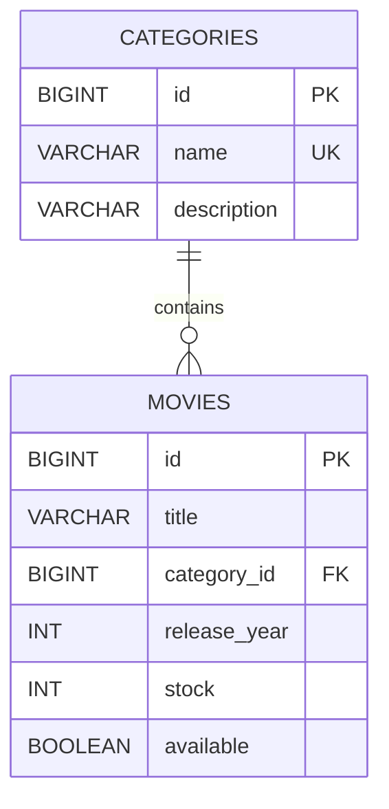
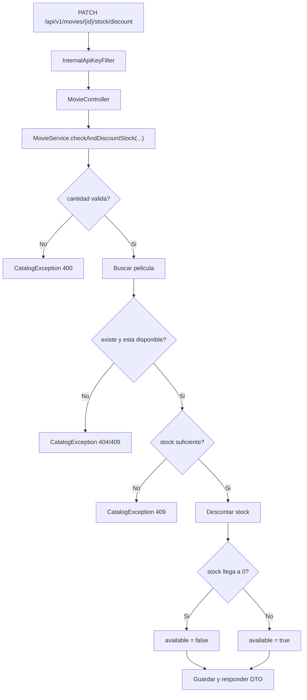

# ms-catalog

Autor: Martin Caviedes

`ms-catalog` administra categorias, peliculas y stock del sistema Blockbuster. Es el servicio que responde por el inventario logico del catalogo y expone la operacion interna que usa `transactions` para descontar unidades durante un arriendo.

## Vista rapida

| Aspecto | Valor |
| --- | --- |
| Puerto | `8081` |
| Base de datos | PostgreSQL Neon |
| Seguridad externa | JWT Bearer |
| Seguridad interna | API key compartida |
| Integracion entrante | `transactions -> stock discount` |
| Documentacion | `/swagger-ui.html` |

## Stack real

- Java 21
- Spring Boot 4.0.6
- Spring Data JPA
- Spring Security
- PostgreSQL
- Flyway
- Spring Validation
- OpenFeign
- Springdoc OpenAPI
- JJWT
- JUnit 5, Mockito, MockMvc

## Que resuelve

- CRUD de categorias
- CRUD de peliculas
- consultas por categoria, titulo y disponibilidad
- validacion de stock y disponibilidad
- descuento atomico de stock para arriendos

## Seguridad

### Endpoints publicos

- `/swagger-ui.html`
- `/v3/api-docs`

### Endpoints protegidos por JWT

- `POST /api/v1/categories`
- `GET /api/v1/categories`
- `GET /api/v1/categories/{id}`
- `PUT /api/v1/categories/{id}`
- `DELETE /api/v1/categories/{id}`
- `POST /api/v1/movies`
- `GET /api/v1/movies`
- `GET /api/v1/movies/{id}`
- `GET /api/v1/movies/category/{categoryId}`
- `GET /api/v1/movies/search`
- `GET /api/v1/movies/available`
- `PUT /api/v1/movies/{id}`
- `DELETE /api/v1/movies/{id}`

### Endpoint interno protegido por API key

- `PATCH /api/v1/movies/{id}/stock/discount?quantity=n`

Este endpoint esta marcado `permitAll` en la cadena de seguridad solo para permitir la verificacion por `InternalApiKeyFilter`. No es un endpoint publico funcional sin la cabecera:

```text
X-Internal-Api-Key: <shared-key>
```

## Variables locales

Crea un archivo `.env` en [catalog/catalog](</C:/Users/marti/OneDrive/Desktop/BlockBuster Microservices/blockbuster-microservices/catalog/catalog>) usando como base [.env.example](</C:/Users/marti/OneDrive/Desktop/BlockBuster Microservices/blockbuster-microservices/catalog/catalog/.env.example>):

```properties
DB_USERNAME=neondb_owner
DB_PASSWORD=tu_password_aqui
JWT_SECRET=replace_with_a_256_bit_secret
JWT_EXPIRATION=86400000
INTERNAL_API_KEY=replace_with_shared_internal_api_key
```

## Modelo



## Flujo de stock



## Migraciones

Flyway aplica estas versiones:

- `V1__create_initial_tables.sql`
- `V2__insert_initial_data.sql`
- `V3__add_audit_or_constraints.sql`

## Contratos principales

### Crear categoria

```bash
curl -X POST "http://localhost:8081/api/v1/categories" \
  -H "Authorization: Bearer TU_TOKEN" \
  -H "Content-Type: application/json" \
  -d '{"name":"Drama","description":"Peliculas dramaticas"}'
```

### Crear pelicula

```bash
curl -X POST "http://localhost:8081/api/v1/movies" \
  -H "Authorization: Bearer TU_TOKEN" \
  -H "Content-Type: application/json" \
  -d '{"title":"Inception","categoryId":3,"releaseYear":2010,"stock":6,"available":true}'
```

### Descuento interno de stock

```bash
curl -X PATCH "http://localhost:8081/api/v1/movies/1/stock/discount?quantity=2" \
  -H "X-Internal-Api-Key: SHARED_KEY"
```

## Ejecucion y pruebas

Desde [catalog/catalog](</C:/Users/marti/OneDrive/Desktop/BlockBuster Microservices/blockbuster-microservices/catalog/catalog>):

```powershell
mvn test
mvn spring-boot:run
```

La suite validada cubre:

- arranque de contexto
- Flyway + H2 en pruebas
- mappers
- repositorios
- servicios
- seguridad JWT
- API key interna
- controladores con MockMvc

## Respuesta de error

```json
{
  "timestamp": "2026-05-17T22:00:00",
  "status": 409,
  "message": "Stock insuficiente para la pelicula con ID: 1",
  "path": "/api/v1/movies/1/stock/discount"
}
```
