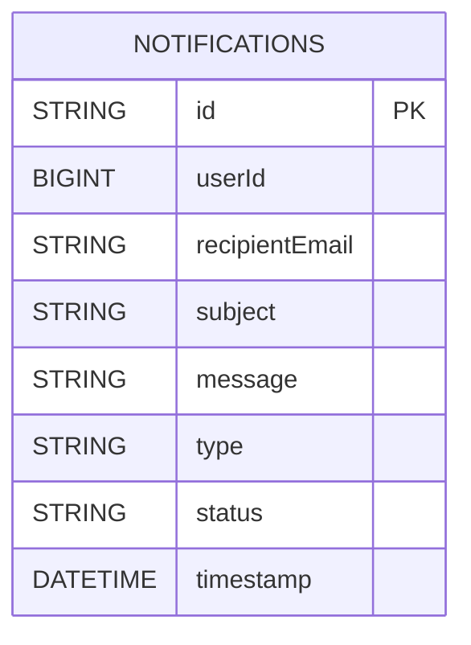
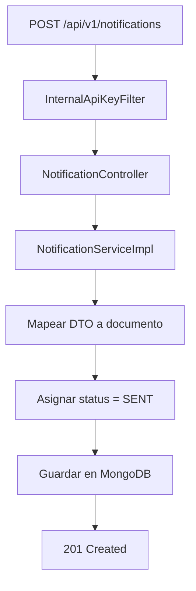

# ms-notifications

Autor: Martin Caviedes

`ms-notifications` centraliza el registro y envio simulado de notificaciones para Blockbuster. El servicio recibe solicitudes internas desde otros microservicios, persiste el evento en MongoDB Atlas y devuelve el resultado con estado `SENT`.

## Vista rapida

| Aspecto | Valor |
| --- | --- |
| Puerto | `8084` |
| Base de datos | MongoDB Atlas |
| Seguridad externa | No expone endpoints de usuario final |
| Seguridad interna | API key compartida |
| Integracion entrante | `ms-users` y `ms-transactions` |
| Documentacion | `/swagger-ui.html` |

## Stack real

- Java 21
- Spring Boot 4.0.6
- Spring Data MongoDB
- Spring Validation
- Springdoc OpenAPI
- OpenFeign
- JUnit 5, Mockito, MockMvc

## Que resuelve

- recepcion de correos internos de bienvenida
- recepcion de confirmaciones de arriendo
- recepcion de confirmaciones de devolucion
- persistencia historica de notificaciones
- respuesta uniforme de errores para validacion y autenticacion interna

## Seguridad

### Endpoints publicos

- `/swagger-ui.html`
- `/v3/api-docs`

### Endpoint interno protegido por API key

- `POST /api/v1/notifications`

La invocacion debe incluir:

```text
X-Internal-Api-Key: <shared-key>
```

## Variables locales

Crea un archivo `.env` en [notifications/notifications](</C:/Users/marti/OneDrive/Desktop/BlockBuster Microservices/blockbuster-microservices/notifications/notifications>) usando como base [notifications/notifications/.env.example](</C:/Users/marti/OneDrive/Desktop/BlockBuster Microservices/blockbuster-microservices/notifications/notifications/.env.example>):

```properties
MONGO_PASSWORD=replace_with_real_mongo_password
INTERNAL_API_KEY=replace_with_shared_internal_api_key
```

## Modelo



## Flujo principal



## Tipos de mensaje usados por el sistema

- `USER_REGISTRATION`
- `RENTAL_CONFIRMATION`
- `RENTAL_RETURN`

## Contrato principal

```bash
curl -X POST "http://localhost:8084/api/v1/notifications" \
  -H "X-Internal-Api-Key: SHARED_KEY" \
  -H "Content-Type: application/json" \
  -d '{
    "userId": 25,
    "recipientEmail": "cliente@blockbuster.com",
    "subject": "Confirmacion de arriendo",
    "message": "Tu arriendo fue creado con exito",
    "type": "RENTAL_CONFIRMATION"
  }'
```

## Ejecucion y pruebas

Desde [notifications/notifications](</C:/Users/marti/OneDrive/Desktop/BlockBuster Microservices/blockbuster-microservices/notifications/notifications>):

```powershell
mvn test
mvn spring-boot:run
```

Cobertura validada:

- rechazo de solicitudes sin API key
- aceptacion de solicitudes internas validas
- validaciones de payload
- respuesta de error uniforme

## Respuesta de error

```json
{
  "timestamp": "2026-05-17T22:00:00",
  "status": 401,
  "message": "API key interna invalida",
  "path": "/api/v1/notifications"
}
```
