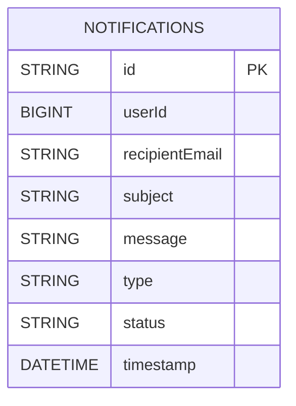
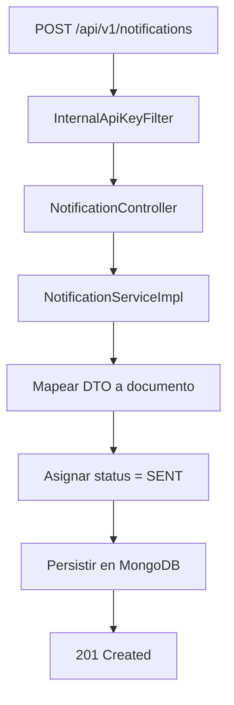

# ms-notifications

`ms-notifications` registra y simula el envio de notificaciones internas del sistema. Recibe solicitudes desde otros microservicios, persiste el evento en MongoDB y responde con estado `SENT`, manteniendo trazabilidad del flujo sin asumir reglas de negocio ajenas.

## Contexto dentro del sistema

Este microservicio participa como servicio transversal. No autentica usuarios finales ni decide arriendos, stock o identidad. Su responsabilidad es persistir eventos de notificacion generados por otros dominios.

## Vista rapida

| Aspecto | Valor |
| --- | --- |
| Puerto | `8084` |
| Persistencia | MongoDB |
| Seguridad externa | no expone flujo de cliente final |
| Seguridad interna | API key compartida |
| Integraciones entrantes | `ms-users` y `ms-transactions` |
| UI OpenAPI | `/swagger-ui.html` |

## Responsabilidades

- registrar notificaciones de bienvenida
- registrar confirmaciones de arriendo
- registrar confirmaciones de devolucion
- persistir historico de mensajes
- responder con estado uniforme al flujo interno

## Endpoints principales

### Publicos

- `/swagger-ui.html`
- `/v3/api-docs`

### Interno protegido por API key

- `POST /api/v1/notifications`

Toda invocacion valida debe incluir:

```text
X-Internal-Api-Key: <shared-key>
```

## Variables de entorno

Crear un archivo `.env` en este modulo usando como base [.env.example](./.env.example).

Variables esperadas:

```properties
MONGO_PASSWORD=replace_with_real_mongo_password
INTERNAL_API_KEY=replace_with_shared_internal_api_key
```

## Persistencia

`ms-notifications` utiliza MongoDB porque el dato persistido es un evento autocontenido, sin relaciones complejas ni necesidad de joins estructurales.

### Modelo documental



## Flujo principal



## Tipos de mensaje usados por el sistema

- `USER_REGISTRATION`
- `RENTAL_CONFIRMATION`
- `RENTAL_RETURN`

## Ejemplo de uso

```bash
curl -X POST "http://localhost:8084/api/v1/notifications" \
  -H "X-Internal-Api-Key: SHARED_KEY" \
  -H "Content-Type: application/json" \
  -d '{
    "userId": 25,
    "recipientEmail": "cliente@blockbuster.com",
    "subject": "Confirmacion de arriendo",
    "message": "Tu arriendo fue creado con exito",
    "type": "RENTAL_CONFIRMATION"
  }'
```

## Ejecucion

Desde este modulo:

```powershell
mvn test
mvn spring-boot:run
```

## Cobertura funcional validada

- rechazo de solicitudes sin API key
- aceptacion de solicitudes internas validas
- validacion de payload
- respuesta uniforme de error

## Formato de error

```json
{
  "timestamp": "2026-05-17T22:00:00",
  "status": 401,
  "message": "API key interna invalida",
  "path": "/api/v1/notifications"
}
```

## Navegacion

- [README principal](../../README.md)
- [Coleccion Postman](../../docs/postman/README.md)
