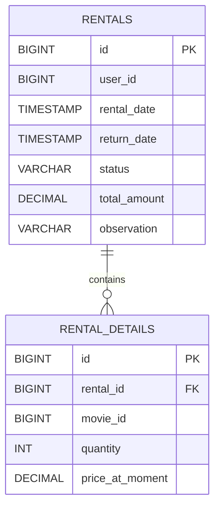
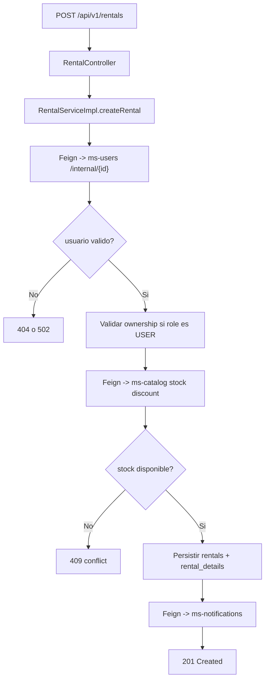
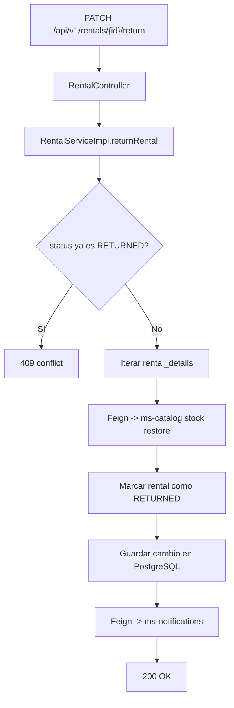

# ms-transactions

Autor: Martin Caviedes

`ms-transactions` gestiona el flujo de arriendos de Blockbuster. Este servicio valida usuarios contra `ms-users`, descuenta stock en `ms-catalog`, registra el arriendo en PostgreSQL y envía confirmaciones a `ms-notifications`. Tambien resuelve la devolucion del arriendo reintegrando stock al catalogo.

## Vista rapida

| Aspecto | Valor |
| --- | --- |
| Puerto | `8083` |
| Base de datos | PostgreSQL Neon |
| Seguridad externa | JWT Bearer |
| Seguridad interna saliente | API key compartida |
| Integraciones salientes | `ms-users`, `ms-catalog`, `ms-notifications` |
| Documentacion | `/swagger-ui.html` |

## Stack real

- Java 21
- Spring Boot 4.0.6
- Spring Security
- Spring Data JPA
- PostgreSQL
- Flyway
- Spring Validation
- Springdoc OpenAPI
- OpenFeign
- Apache HttpClient 5 para Feign `PATCH`
- JJWT
- JUnit 5, Mockito, MockMvc

## Que resuelve

- creacion de arriendos con validacion de usuario y stock
- consulta de arriendos por usuario
- consulta administrativa de todos los arriendos
- devolucion de arriendos con reintegro de stock
- eliminacion administrativa de arriendos
- confirmaciones por correo al crear y devolver un arriendo

## Seguridad

### Endpoints publicos

- `/swagger-ui.html`
- `/v3/api-docs`

### Endpoints protegidos por JWT

- `POST /api/v1/rentals`
- `GET /api/v1/rentals/user/{userId}`
- `GET /api/v1/rentals`
- `PATCH /api/v1/rentals/{id}/return`
- `DELETE /api/v1/rentals/{id}`

### Reglas de autorizacion

- `ROLE_USER`, `ROLE_EMPLOYEE`, `ROLE_ADMIN` pueden crear arriendos
- `ROLE_USER` solo puede crear arriendos para su propia cuenta
- `ROLE_EMPLOYEE` y `ROLE_ADMIN` pueden consultar, devolver y eliminar arriendos

Nota: se mantiene compatibilidad temporal con `PUT /api/v1/rentals/{id}/return`, pero la operacion canonica de devolucion es `PATCH`.

## Variables locales

Crea un archivo `.env` en [transactions/transactions](</C:/Users/marti/OneDrive/Desktop/BlockBuster Microservices/blockbuster-microservices/transactions/transactions>) usando como base [transactions/transactions/.env.example](</C:/Users/marti/OneDrive/Desktop/BlockBuster Microservices/blockbuster-microservices/transactions/transactions/.env.example>):

```properties
DB_USERNAME=neondb_owner
DB_PASSWORD=replace_with_real_password
USERS_SERVICE_URL=http://localhost:8082
CATALOG_SERVICE_URL=http://localhost:8081
NOTIFICATIONS_SERVICE_URL=http://localhost:8084
INTERNAL_API_KEY=replace_with_shared_internal_api_key
JWT_SECRET=replace_with_shared_jwt_secret_256_bits_minimum_length_for_all_services
JWT_EXPIRATION=86400000
```

## Modelo



## Flujo principal de arriendo



## Flujo de devolucion



## Integracion saliente

- `GET /api/v1/users/internal/{id}` en `ms-users`
- `PATCH /api/v1/movies/{id}/stock/discount?quantity=n` en `ms-catalog`
- `PATCH /api/v1/movies/{id}/stock/restore?quantity=n` en `ms-catalog`
- `POST /api/v1/notifications` en `ms-notifications`

## Migraciones

Flyway aplica estas versiones:

- `V1__create_initial_tables.sql`
- `V2__insert_data.sql`
- `V3__add_observation_column.sql`

## Contratos principales

### Crear arriendo

```bash
curl -X POST "http://localhost:8083/api/v1/rentals" \
  -H "Authorization: Bearer USER_TOKEN" \
  -H "Content-Type: application/json" \
  -d '{
    "userId": 25,
    "movies": [
      {
        "movieId": 8,
        "quantity": 1
      }
    ]
  }'
```

### Consultar arriendos por usuario

```bash
curl -X GET "http://localhost:8083/api/v1/rentals/user/25" \
  -H "Authorization: Bearer ADMIN_TOKEN"
```

### Devolver arriendo

```bash
curl -X PATCH "http://localhost:8083/api/v1/rentals/10/return" \
  -H "Authorization: Bearer ADMIN_TOKEN"
```

### Eliminar arriendo

```bash
curl -X DELETE "http://localhost:8083/api/v1/rentals/10" \
  -H "Authorization: Bearer ADMIN_TOKEN"
```

## Ejecucion y pruebas

Desde [transactions/transactions](</C:/Users/marti/OneDrive/Desktop/BlockBuster Microservices/blockbuster-microservices/transactions/transactions>):

```powershell
mvn test
mvn spring-boot:run
```

Cobertura validada:

- validacion de flujo de arriendo
- restriccion de ownership para `ROLE_USER`
- seguridad de endpoints por rol
- restauracion de stock al devolver
- tolerancia ante falla de `notifications`
- controladores con MockMvc

## Respuesta de error

```json
{
  "timestamp": "2026-05-17T22:00:00",
  "status": 409,
  "message": "El arriendo con ID 10 ya fue marcado como devuelto",
  "path": "/api/v1/rentals/10/return"
}
```
