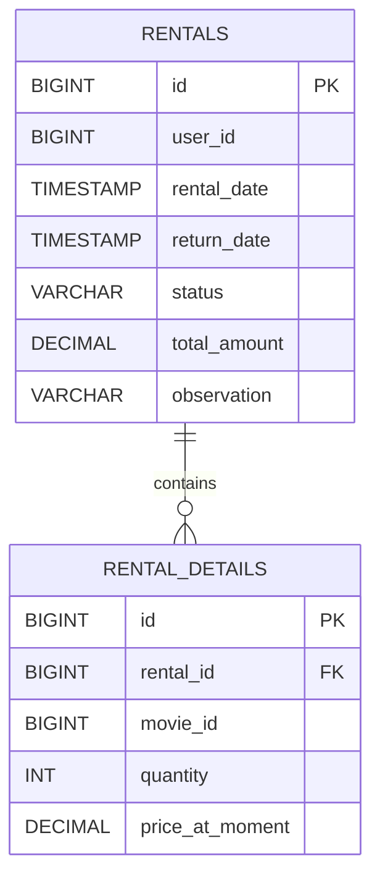
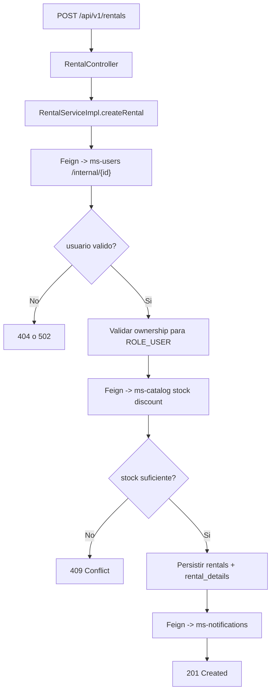
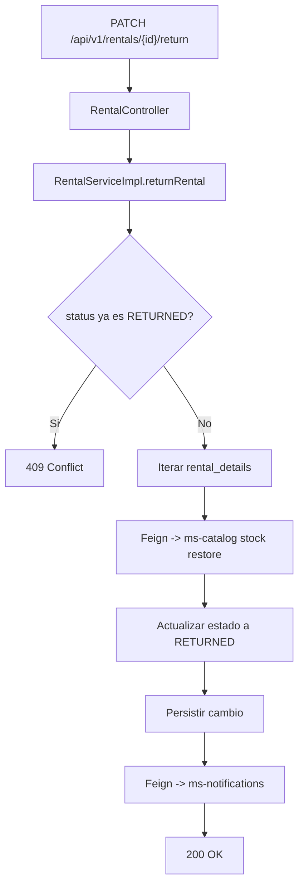

# ms-transactions

`ms-transactions` coordina el caso de uso principal del sistema: la creacion y devolucion de arriendos. Este servicio valida usuarios con `ms-users`, descuenta y reintegra stock en `ms-catalog`, persiste arriendos en PostgreSQL y registra confirmaciones en `ms-notifications`.

## Contexto dentro del sistema

Este microservicio no es duenio de usuarios ni de peliculas. Su responsabilidad es orquestar el flujo de negocio del arriendo respetando la propiedad de datos de los otros dominios.

## Vista rapida

| Aspecto | Valor |
| --- | --- |
| Puerto | `8083` |
| Persistencia | PostgreSQL |
| Seguridad externa | JWT Bearer |
| Seguridad interna saliente | API key compartida |
| Integraciones salientes | `ms-users`, `ms-catalog`, `ms-notifications` |
| UI OpenAPI | `/swagger-ui.html` |

## Responsabilidades

- crear arriendos
- consultar arriendos por usuario
- consultar todos los arriendos
- devolver arriendos
- eliminar arriendos
- coordinar integracion con usuarios, catalogo y notificaciones

## Endpoints principales

### Publicos

- `/swagger-ui.html`
- `/v3/api-docs`

### Protegidos por JWT

- `POST /api/v1/rentals`
- `GET /api/v1/rentals/user/{userId}`
- `GET /api/v1/rentals`
- `PATCH /api/v1/rentals/{id}/return`
- `DELETE /api/v1/rentals/{id}`

### Reglas de autorizacion

- `ROLE_USER`, `ROLE_EMPLOYEE` y `ROLE_ADMIN` pueden crear arriendos
- `ROLE_USER` solo puede crear arriendos para su propia cuenta
- `ROLE_EMPLOYEE` y `ROLE_ADMIN` pueden consultar, devolver y eliminar arriendos

La operacion canonica de devolucion es `PATCH`. Se conserva compatibilidad con `PUT` por razones de transicion del contrato.

## Variables de entorno

Crear un archivo `.env` en este modulo usando como base [.env.example](./.env.example).

Variables esperadas:

```properties
DB_USERNAME=neondb_owner
DB_PASSWORD=replace_with_real_password
USERS_SERVICE_URL=http://localhost:8082
CATALOG_SERVICE_URL=http://localhost:8081
NOTIFICATIONS_SERVICE_URL=http://localhost:8084
INTERNAL_API_KEY=replace_with_shared_internal_api_key
JWT_SECRET=replace_with_shared_jwt_secret_256_bits_minimum_length_for_all_services
JWT_EXPIRATION=86400000
```

## Persistencia y migraciones

Flyway aplica:

- `V1__create_transactions_schema.sql`
- `V2__insert_data.sql`
- `V3__add_observation_column.sql`

### Modelo relacional



## Flujo de arriendo



## Flujo de devolucion



## Integracion saliente

- `GET /api/v1/users/internal/{id}` en `ms-users`
- `PATCH /api/v1/movies/{id}/stock/discount?quantity=n` en `ms-catalog`
- `PATCH /api/v1/movies/{id}/stock/restore?quantity=n` en `ms-catalog`
- `POST /api/v1/notifications` en `ms-notifications`

## Ejemplos de uso

### Crear arriendo

```bash
curl -X POST "http://localhost:8083/api/v1/rentals" \
  -H "Authorization: Bearer USER_TOKEN" \
  -H "Content-Type: application/json" \
  -d '{
    "userId": 25,
    "movies": [
      {
        "movieId": 8,
        "quantity": 1
      }
    ]
  }'
```

### Consultar arriendos por usuario

```bash
curl -X GET "http://localhost:8083/api/v1/rentals/user/25" \
  -H "Authorization: Bearer ADMIN_TOKEN"
```

### Devolver arriendo

```bash
curl -X PATCH "http://localhost:8083/api/v1/rentals/10/return" \
  -H "Authorization: Bearer ADMIN_TOKEN"
```

## Ejecucion

Desde este modulo:

```powershell
mvn test
mvn spring-boot:run
```

## Cobertura funcional validada

- validacion del flujo de arriendo
- restriccion de ownership para `ROLE_USER`
- seguridad por rol
- reintegro de stock al devolver
- tolerancia a falla de `notifications`
- controladores con MockMvc

## Formato de error

```json
{
  "timestamp": "2026-05-17T22:00:00",
  "status": 409,
  "message": "El arriendo con ID 10 ya fue marcado como devuelto",
  "path": "/api/v1/rentals/10/return"
}
```

## Navegacion

- [README principal](../../README.md)
- [Coleccion Postman](../../docs/postman/README.md)
