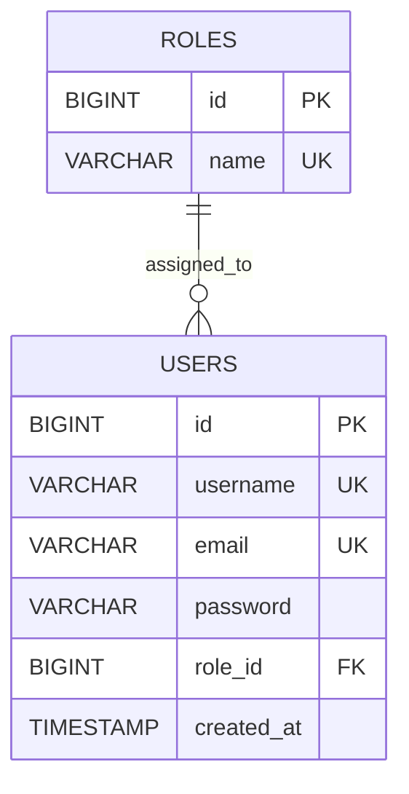
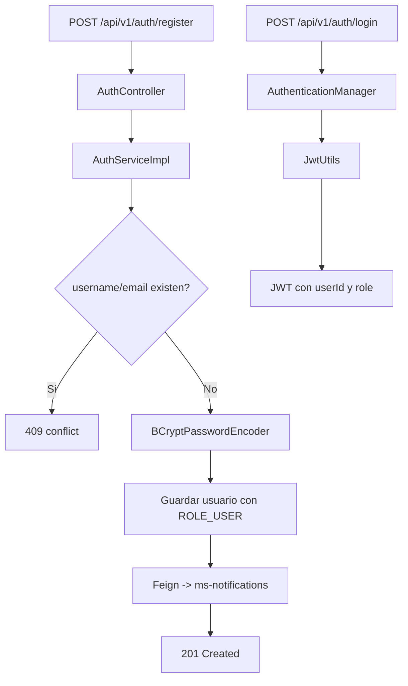

# ms-users

Autor: Martin Caviedes

`ms-users` concentra identidad, autenticacion y gestion de usuarios para Blockbuster. Este servicio registra cuentas, autentica con JWT stateless, expone consultas protegidas para usuarios internos del sistema y dispara la notificacion de bienvenida al completar un registro.

## Vista rapida

| Aspecto | Valor |
| --- | --- |
| Puerto | `8082` |
| Base de datos | PostgreSQL Neon |
| Seguridad externa | JWT Bearer |
| Seguridad interna | API key compartida |
| Integracion saliente | `ms-notifications` por OpenFeign |
| Documentacion | `/swagger-ui.html` |

## Stack real

- Java 21
- Spring Boot 4.0.6
- Spring Security
- JJWT
- Spring Data JPA
- PostgreSQL
- Flyway
- Spring Validation
- Springdoc OpenAPI
- OpenFeign
- JUnit 5, Mockito, MockMvc

## Que resuelve

- Registro con validacion preventiva de `username` y `email`
- Encriptacion de password con BCrypt
- Login stateless con JWT firmado
- Consulta protegida de usuarios por rol
- Endpoint interno para interoperabilidad con `transactions`
- Envio de correo de bienvenida a traves de `notifications`

## Seguridad

### Endpoints publicos

- `POST /api/v1/auth/register`
- `POST /api/v1/auth/login`
- `/swagger-ui.html`
- `/v3/api-docs`

### Endpoints protegidos por JWT

- `GET /api/v1/users`
- `GET /api/v1/users/{id}`

### Endpoint interno protegido por API key

- `GET /api/v1/users/internal/{id}`

Este endpoint no usa JWT de usuario final. Solo acepta la cabecera:

```text
X-Internal-Api-Key: <shared-key>
```

## Variables locales

Crea un archivo `.env` en [users/users](</C:/Users/marti/OneDrive/Desktop/BlockBuster Microservices/blockbuster-microservices/users/users>) usando como base [users/users/.env.example](</C:/Users/marti/OneDrive/Desktop/BlockBuster Microservices/blockbuster-microservices/users/users/.env.example>):

```properties
DB_USERNAME=neondb_owner
DB_PASSWORD=replace_with_real_password
JWT_SECRET=replace_with_a_256_bit_secret
JWT_EXPIRATION=86400000
INTERNAL_API_KEY=replace_with_shared_internal_api_key
NOTIFICATIONS_SERVICE_URL=http://localhost:8084
```

## Migraciones

Flyway aplica estas tres versiones:

- `V1__create_initial_tables.sql`
- `V2__insert_initial_data.sql`
- `V3__add_audit_or_constraints.sql`

Usuario administrador semilla:

| Campo | Valor |
| --- | --- |
| `username` | `admin` |
| `email` | `admin@blockbuster.com` |
| `password` | `Admin123!` |
| `role` | `ROLE_ADMIN` |

## Modelo



## Flujo principal



## Contratos relevantes

### Registro

```bash
curl -X POST "http://localhost:8082/api/v1/auth/register" \
  -H "Content-Type: application/json" \
  -d '{
    "username": "martin",
    "email": "martin@blockbuster.com",
    "password": "Admin123!"
  }'
```

### Login

```bash
curl -X POST "http://localhost:8082/api/v1/auth/login" \
  -H "Content-Type: application/json" \
  -d '{
    "username": "admin",
    "password": "Admin123!"
  }'
```

### Consulta interna para `transactions`

```bash
curl -X GET "http://localhost:8082/api/v1/users/internal/25" \
  -H "X-Internal-Api-Key: SHARED_KEY"
```

## Pruebas

Desde [users/users](</C:/Users/marti/OneDrive/Desktop/BlockBuster Microservices/blockbuster-microservices/users/users>):

```powershell
mvn test
mvn spring-boot:run
```

Cobertura actual validada:

- DTOs y validaciones
- mappers manuales
- repositorios con Flyway + H2
- servicios de registro y autenticacion
- seguridad JWT y API key interna
- controladores con MockMvc

## Respuesta de error

```json
{
  "timestamp": "2026-05-17T01:00:00",
  "status": 401,
  "message": "Credenciales invalidas",
  "path": "/api/v1/auth/login"
}
```
