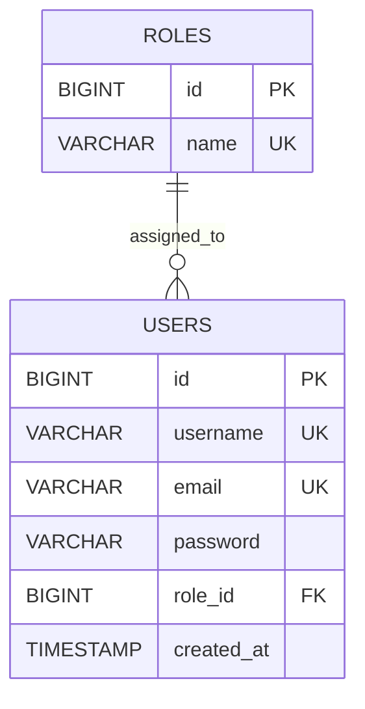
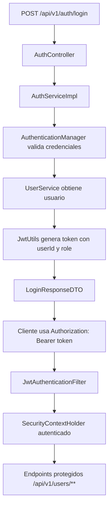

# ms-users

Autor: Martin Caviedes

`ms-users` es el microservicio encargado de la seguridad y la gestion de usuarios del sistema Blockbuster. Expone registro, login stateless con JWT y endpoints protegidos para consulta de usuarios.

## Stack

- Java 21
- Spring Boot 4.0.6
- Spring Security
- JWT (`jjwt`)
- Spring Data JPA
- PostgreSQL
- Flyway
- Spring Validation
- Springdoc OpenAPI
- JUnit 5, Mockito, MockMvc

## Variables Locales

Crea un archivo `.env` en [users/users](</C:/Users/marti/OneDrive/Desktop/BlockBuster Microservices/blockbuster-microservices/users/users>) usando como base [users/users/.env.example](</C:/Users/marti/OneDrive/Desktop/BlockBuster Microservices/blockbuster-microservices/users/users/.env.example>):

```properties
DB_USERNAME=neondb_owner
DB_PASSWORD=tu_password_real
JWT_SECRET=una_clave_de_256_bits_o_mas
JWT_EXPIRATION=86400000
```

## Ejecucion

Desde [users/users](</C:/Users/marti/OneDrive/Desktop/BlockBuster Microservices/blockbuster-microservices/users/users>):

```bash
mvn test
mvn spring-boot:run
```

La API queda disponible en:

- `http://localhost:8082`
- Swagger UI: `http://localhost:8082/swagger-ui.html`

## Migraciones

Flyway aplica estas versiones:

- `V1__create_initial_tables.sql`
- `V2__insert_initial_data.sql`
- `V3__add_audit_or_constraints.sql`

Usuarios semilla recomendados para demo:

| username | email | role | password |
| --- | --- | --- | --- |
| `admin` | `admin@blockbuster.com` | `ROLE_ADMIN` | `Admin123!` |
| `empleado.centro` | `empleado.centro@blockbuster.com` | `ROLE_EMPLOYEE` | `Admin123!` |
| `laura.cliente` | `laura.cliente@blockbuster.com` | `ROLE_USER` | `Admin123!` |
| `pedro.rentas` | `pedro.rentas@blockbuster.com` | `ROLE_USER` | `Admin123!` |
| `sofia.nostalgia` | `sofia.nostalgia@blockbuster.com` | `ROLE_USER` | `Admin123!` |

## Modelo



## Flujo JWT



## Endpoints

### Autenticacion

- `POST /api/v1/auth/register`
- `POST /api/v1/auth/login`

### Usuarios

- `GET /api/v1/users`
- `GET /api/v1/users/{id}`

## Ejemplos Curl

Registro:

```bash
curl -X POST "http://localhost:8082/api/v1/auth/register" \
  -H "Content-Type: application/json" \
  -d '{
    "username": "martin",
    "email": "martin@blockbuster.com",
    "password": "Admin123!"
  }'
```

Login:

```bash
curl -X POST "http://localhost:8082/api/v1/auth/login" \
  -H "Content-Type: application/json" \
  -d '{
    "username": "admin",
    "password": "Admin123!"
  }'
```

Consulta protegida:

```bash
curl -X GET "http://localhost:8082/api/v1/users" \
  -H "Authorization: Bearer TU_TOKEN"
```

## Formato De Error

```json
{
  "timestamp": "2026-05-17T01:00:00",
  "status": 401,
  "message": "Credenciales invalidas",
  "path": "/api/v1/auth/login"
}
```
