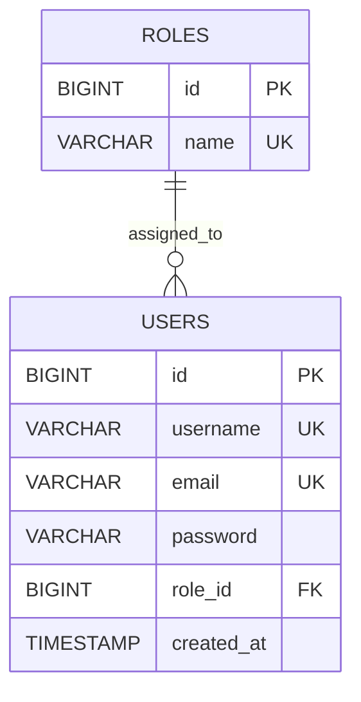
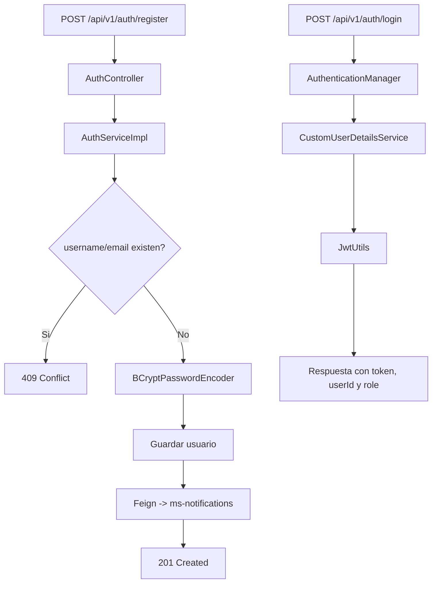

# ms-users

`ms-users` concentra identidad, autenticacion y gestion de usuarios del sistema. Registra cuentas, autentica credenciales con JWT stateless, expone consultas protegidas para consumo externo y habilita un endpoint interno para integracion con `ms-transactions`.

## Contexto dentro del sistema

Este microservicio resuelve el dominio de identidad:

- registro de usuarios
- login
- roles
- consulta protegida de usuarios
- consulta interna de usuario para flujos coordinados

Ademas, al completar un registro, genera un evento hacia `ms-notifications`.

## Vista rapida

| Aspecto | Valor |
| --- | --- |
| Puerto | `8082` |
| Persistencia | PostgreSQL |
| Seguridad externa | JWT Bearer |
| Seguridad interna | API key compartida |
| Integracion saliente | `ms-notifications` |
| UI OpenAPI | `/swagger-ui.html` |

## Responsabilidades

- registrar usuarios con validacion de `username` y `email`
- cifrar password con BCrypt
- autenticar usuarios
- emitir JWT firmado
- exponer usuarios por rol y por ID
- responder consultas internas desde `transactions`

## Endpoints principales

### Publicos

- `POST /api/v1/auth/register`
- `POST /api/v1/auth/login`
- `/swagger-ui.html`
- `/v3/api-docs`

### Protegidos por JWT

- `GET /api/v1/users`
- `GET /api/v1/users/{id}`

### Interno protegido por API key

- `GET /api/v1/users/internal/{id}`

Este endpoint no esta pensado para clientes finales. Solo acepta:

```text
X-Internal-Api-Key: <shared-key>
```

## Seguridad

### JWT

`ms-users` es el servicio que genera el JWT del sistema. El token contiene la identidad del usuario y su rol, y luego puede ser validado por `catalog` y `transactions`.

### API key interna

Se usa exclusivamente para llamadas entre microservicios, evitando que la integracion interna dependa solo del Bearer token del cliente.

## Variables de entorno

Crear un archivo `.env` en este modulo usando como base [.env.example](./.env.example).

Variables esperadas:

```properties
DB_USERNAME=neondb_owner
DB_PASSWORD=replace_with_real_password
JWT_SECRET=replace_with_a_256_bit_secret
JWT_EXPIRATION=86400000
INTERNAL_API_KEY=replace_with_shared_internal_api_key
NOTIFICATIONS_SERVICE_URL=http://localhost:8084
```

## Persistencia y migraciones

Flyway aplica estas migraciones:

- `V1__create_initial_tables.sql`
- `V2__insert_initial_data.sql`
- `V3__add_audit_or_constraints.sql`

### Modelo relacional



## Flujo principal



## Datos de demo

Usuarios semilla relevantes:

| username | role | password |
| --- | --- | --- |
| `admin` | `ROLE_ADMIN` | `Admin123!` |
| `empleado.centro` | `ROLE_EMPLOYEE` | `Admin123!` |
| `laura.cliente` | `ROLE_USER` | `Admin123!` |

## Ejemplos de uso

### Registro

```bash
curl -X POST "http://localhost:8082/api/v1/auth/register" \
  -H "Content-Type: application/json" \
  -d '{
    "username": "nuevo.usuario",
    "email": "nuevo.usuario@blockbuster.com",
    "password": "Admin123!"
  }'
```

### Login

```bash
curl -X POST "http://localhost:8082/api/v1/auth/login" \
  -H "Content-Type: application/json" \
  -d '{
    "username": "admin",
    "password": "Admin123!"
  }'
```

### Consulta interna

```bash
curl -X GET "http://localhost:8082/api/v1/users/internal/25" \
  -H "X-Internal-Api-Key: SHARED_KEY"
```

## Ejecucion

Desde este modulo:

```powershell
mvn test
mvn spring-boot:run
```

## Cobertura funcional validada

- validaciones DTO
- mapeo de entidades y DTOs
- autenticacion y emision JWT
- seguridad por rol
- endpoint interno con API key
- controladores con MockMvc

## Formato de error

```json
{
  "timestamp": "2026-05-17T01:00:00",
  "status": 401,
  "message": "Credenciales invalidas",
  "path": "/api/v1/auth/login"
}
```

## Navegacion

- [README principal](../../README.md)
- [Coleccion Postman](../../docs/postman/README.md)
